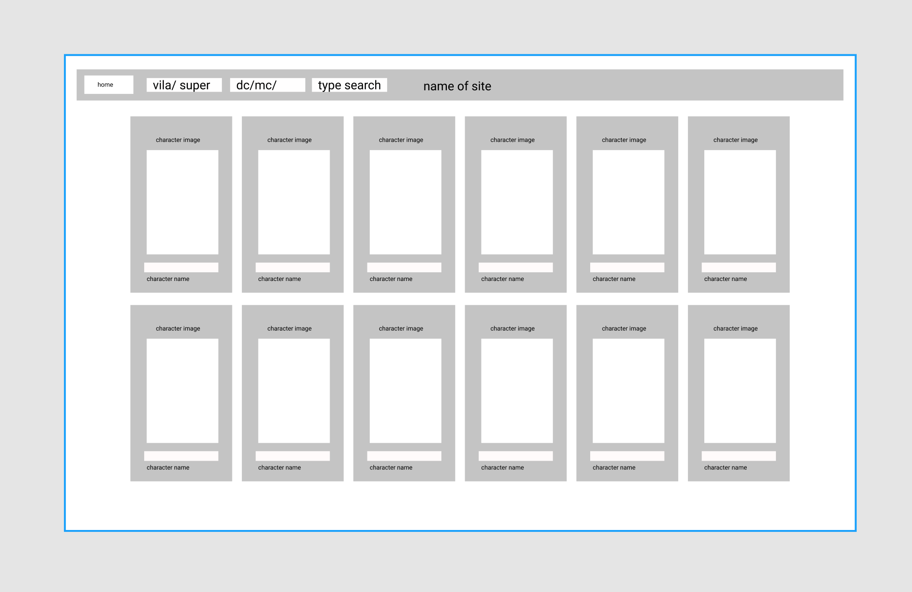
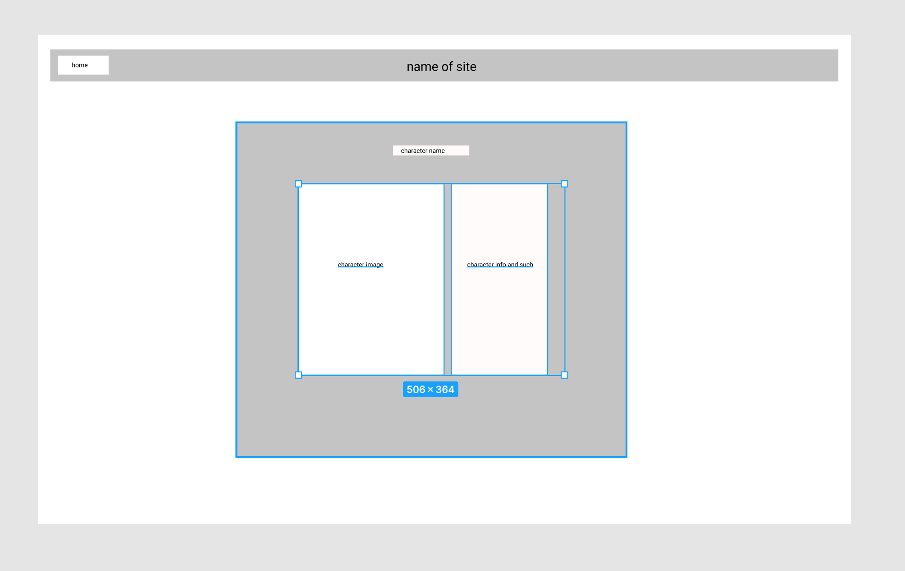
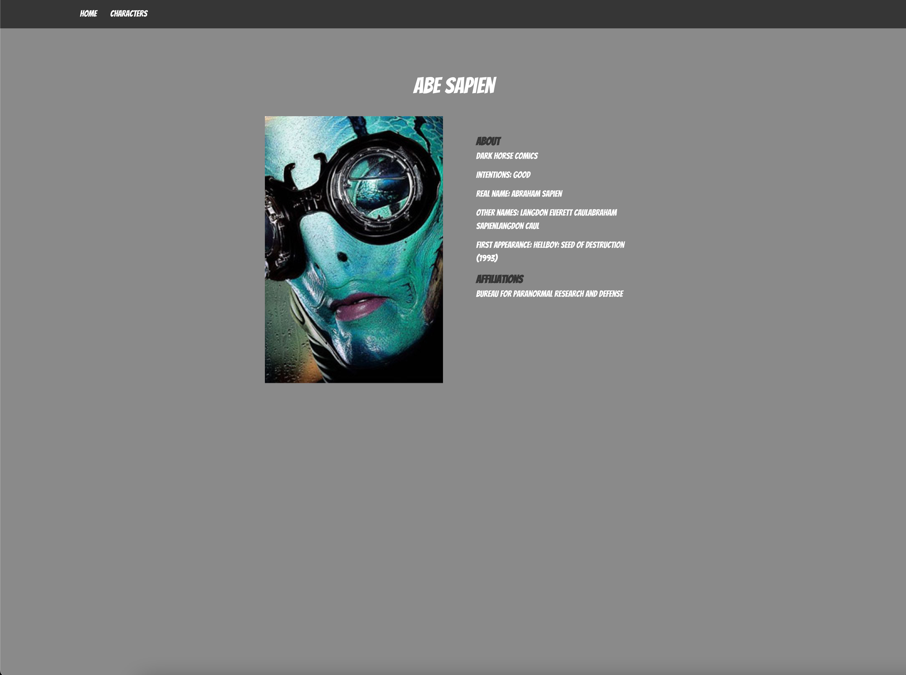

#  Project 2 - Superheros

  

## Brief 
For the second project, we were tasked with creating a React app in, 48 hours, that used an API of our choosing.

## Deployment
click [here](https://project2-sei55-heros.netlify.app/) to see the deployed site.

## Technologies 
- React
- Google Fonts
- Node.js
- Axios
- Bulma
- Backend API [here](https://akabab.github.io/superhero-api/api/)
- CSS
- HTML
- JavaScript

## Members
- Bradley Bernard - [Github](https://github.com/bradb345)
- Gursham Singh - [Github](https://github.com/Gursham2001)

## Approach
- We were given a list of resources that had API's that we could choose from. After some time, we decided to use the Superhero-api. Our site would be a hub where you can search all the superheros  and learn more about them.

### layout
- Firstly, we sketched out a basic wireframe idea of what we wanted the character index page to look like.


Then added another wireframe of what the character show page would roughly look like.


### Getting All Characters and Error Handling
- For the characters, I made a try catch async function that makes a GET request to the API to get all the Characters. after awaiting the request, If the request was successful I set the response data to state, if the request failed I set the isError state to true. If there was no error but the characters state is still null, then that means that isLoading is true. if any of these states and constants are true then a message is conditionally rendered to the page.

```js
const [characters, setCharacters] = React.useState(null)

  const [select1, setSelect1] = React.useState('Universe')
  const [select2, setSelect2] = React.useState('Motive')
  const [input, setInput] = React.useState('')
  const [isError, setIsError] = React.useState(false)
  const isLoading = !characters && !isError
  const history = useHistory()
```

```js
React.useEffect(() => {
    const getData = async () => {
      try {
        const res = await getAllCharaters()
        
        setCharacters(res.data)
      } catch (error) {
        setIsError(true)
      }
    }
    getData()
  }, [])
```

### Filtering and Mapping.

- We wrote a function that filters and returns characters  based on the values of the two selects and the input typed by a user in the search input. 

```js
const handleSelect1 = (e) => {
    setSelect1(e.target.value)
  }

  const handleSelect2 = (e) => {
    setSelect2(e.target.value)
  }

  const handleInput = (e) => {
    setInput(e.target.value)
  }

  const filterCharacters = () => {
    return (
      characters.filter((character)=>{
        return (
          character.name.toLowerCase().includes(input) && (character.biography.publisher === select1 || select1 === 'Universe') && (character.biography.alignment === select2 || select2 === 'Motive')
        )
      })
    )
  }
```

- This filter function is then mapped and the desired Object Keys are passed into the CharacterCard component as props. 

```js
  {isError && <p>... something went wrong</p>}
  {isLoading && <p>...loading</p>}
  {characters && filterCharacters().map(character => (
    <CharacterCard
      key={character.id}
      id={character.id}
      name={character.name}
      image={character.images}
    />
  ))}
```

### Character Card 
- The CharacterCard component imports the props passed down and displays them in the card all wrapped by a link that links them to their own Character show URL.

```js
function CharacterCard({ name, image, id }) {
  return ( 
    <div className='column is-one-quarter-desktop is-one-third-tablet is-one-half-mobile'>
      <div className='boxContent'>
        <Link to={`/characters/${id}`}>
          <div className='card'>
            <div className='card-header'>
              <h1>{name}</h1>
            </div>
          </div>
          <div className='card-image'>
            <figure className='image image-is-1by1'>
              
            </figure>
          </div>
        </Link>
      </div>
    </div>
  )
}
```

### Character Show

- The CharacterShow component takes the character ID found in the url and uses it to make another async try catch Get request, but unlike the Previous GET request this one only returns a single Character Object. All the error handing is exactly the same as the previous GET request though.  The desired Object Keys are then taken and displayed on the page.

```js
React.useEffect(() => {
    const getData = async () => {
      try {
        const res = await getSingleCharacter(characterId)
        setCharacter(res.data)
      } catch (error) {
        setIsError(true)
      }
      
    }  
    getData()
  }, [characterId])

  return (
    <section className="section">
      <div className='container'>
        {isLoading && <p>...loading</p>}
        {isError && <p>oh No something went wrong</p>}
        {character && (
          <div>
            <div className='bigD'>
              <h1 className="characterName">
                {character.name}
              </h1>
            </div>
            <div className='flex'>
              <div className=''>
                <figure>
                  
                </figure>
              </div>
              <div className='text'>

                <h4 className="subheaders">
                  <strong>About</strong>
                </h4>
                <p className='para'>{character.biography.publisher}</p>
                <p className='para'>Intentions: {character.biography.alignment}</p>
                <p className='para'>Real name: {character.biography.fullName}</p>
                <p className='para'>Other names: {character.biography.aliases}</p>
                <p className='para'>First appearance: {character.biography.firstAppearance}</p>
                <div className=''>
                  <h4 className='subheaders'>
                    <strong>Affiliations</strong>
                  </h4>
                  <p className='para'>{character.connections.groupAffiliation}</p>
                </div>
              </div>
            </div>
          </div>
        
        )
        }
      </div>
    </section>

  )
```

### Random Character Button

- This was a stretch goal I had that would be a button that would select a random character and take you to their show page.

```js
const handleClick = () => {
    const randomIndex = Math.ceil(Math.random() * characters.length - 1)
    if (characters === null) {
      return
    } else {
      history.push(`/characters/${characters[randomIndex].id}`)
    }
      
  }
```


## Screenshots
Character Index


Character Show


### Wins and Challenges 

#### - Challenges

- I was introduced to Bulma during this project. As it was a new technology to me I was struggling to wrap my head around how it worked. Needless to say I spent a lot of time reading the documentation on it.

#### - Wins

-  The functionality of the filtering.
- Getting the Random Character button to work. 


### Key Learning

- API requests
- React
- Bulma

### Future Improvements 
- I’d like to implement more interactivity some how, maybe add a game to the site or something. 